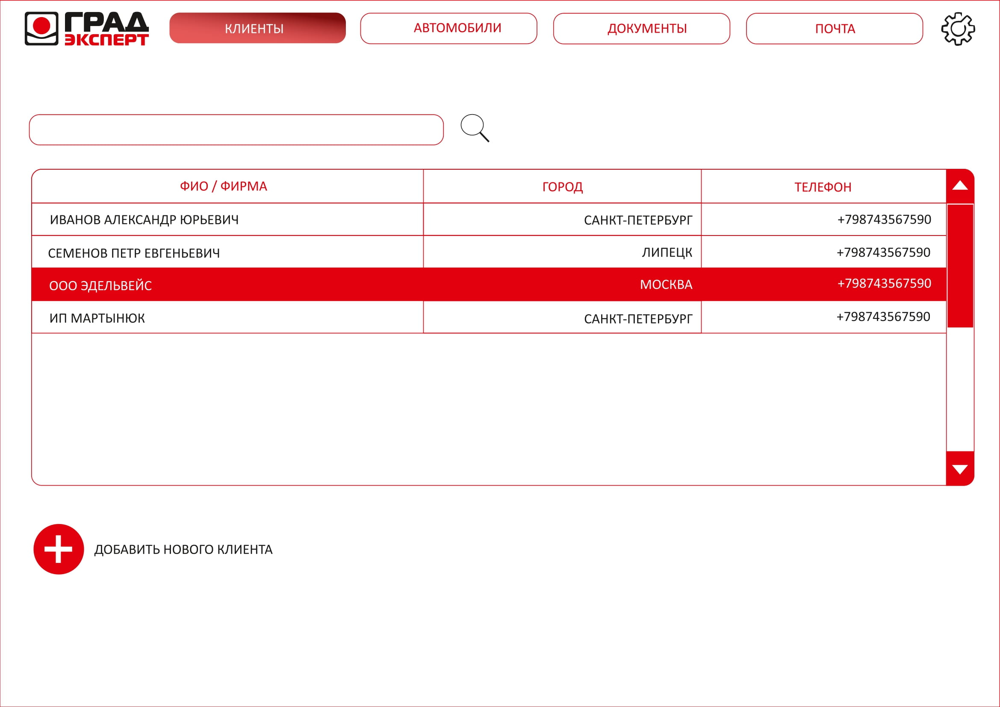
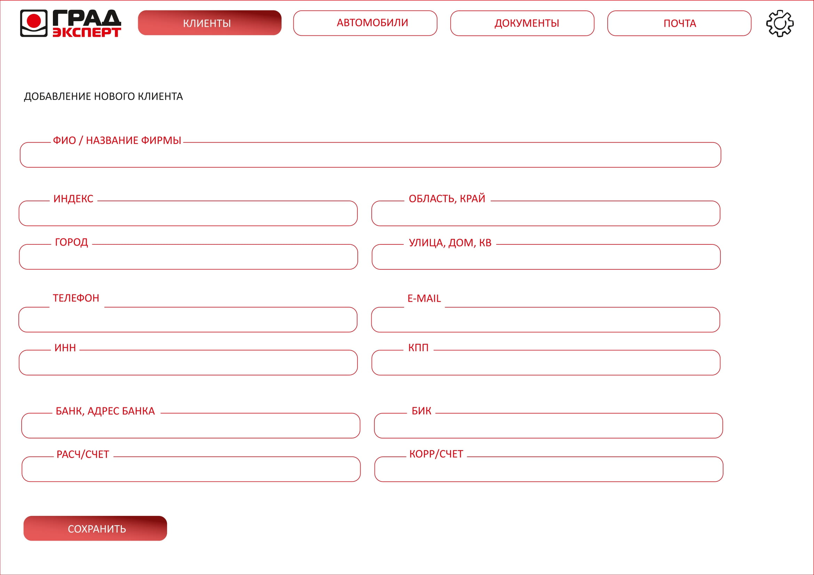
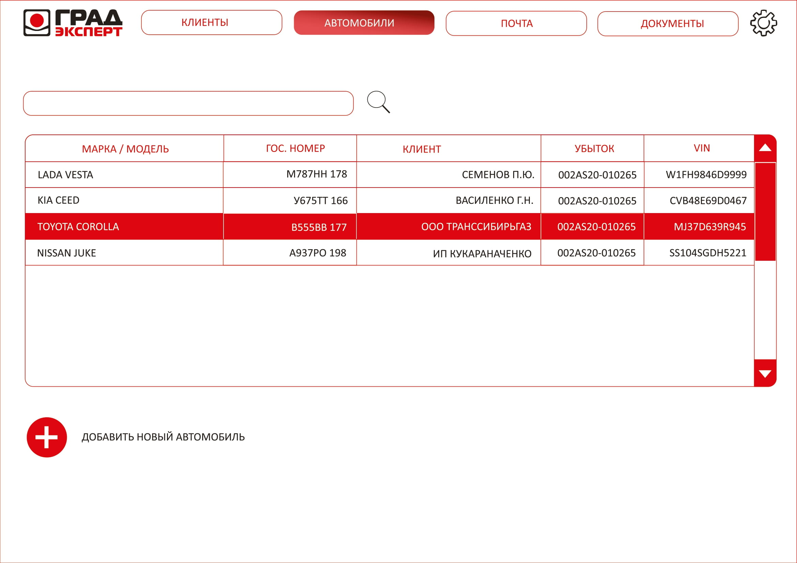
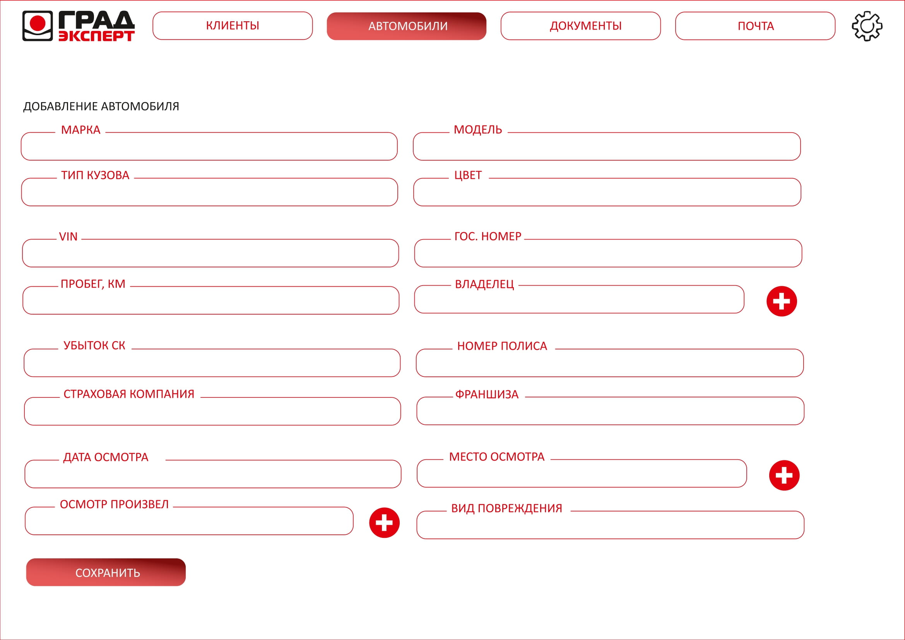
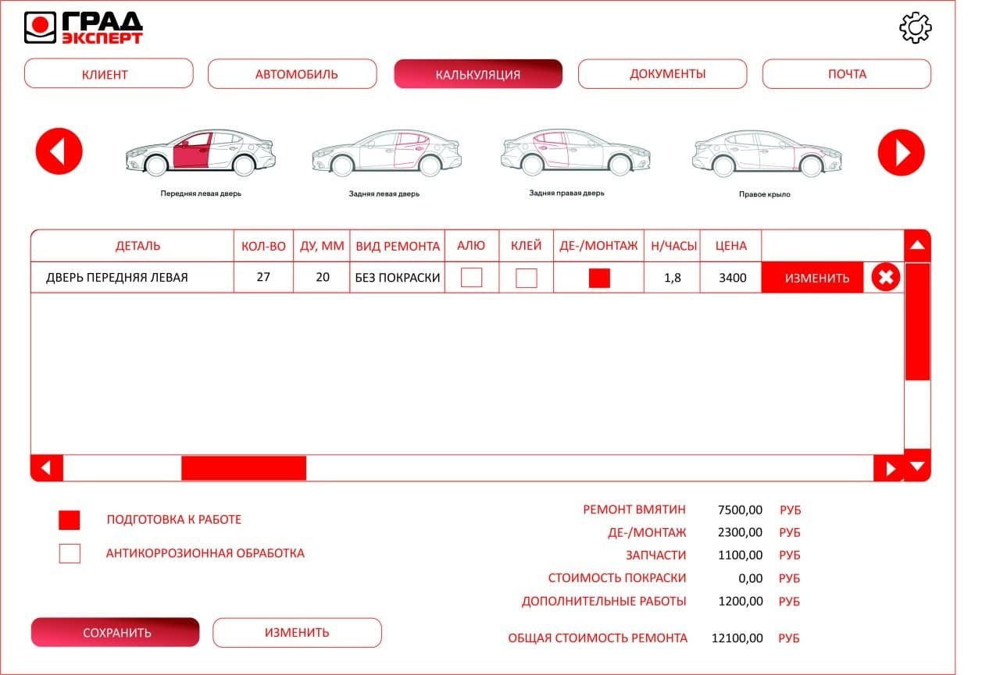
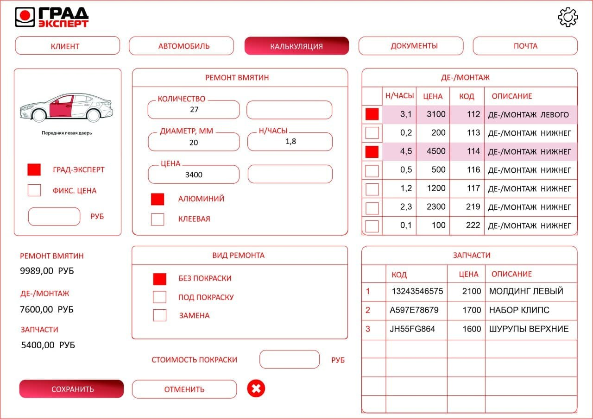
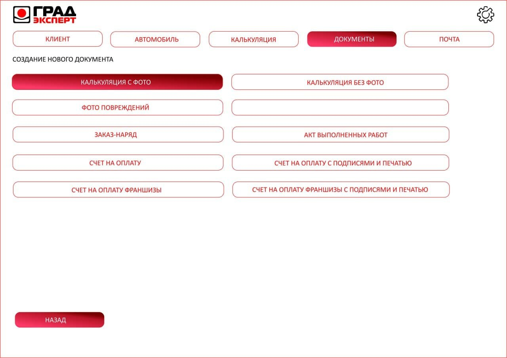
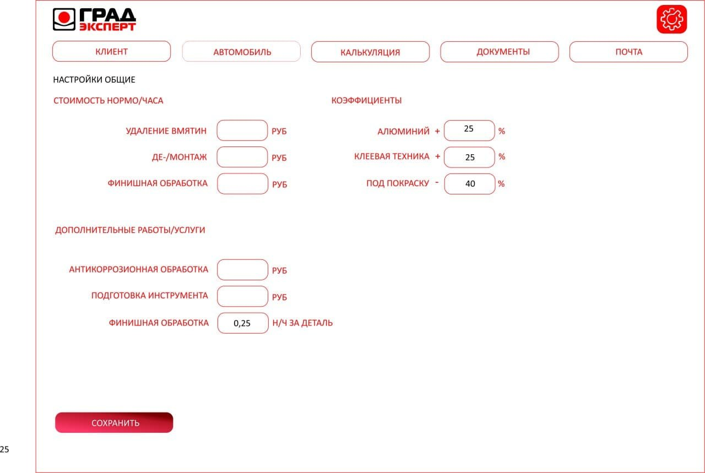
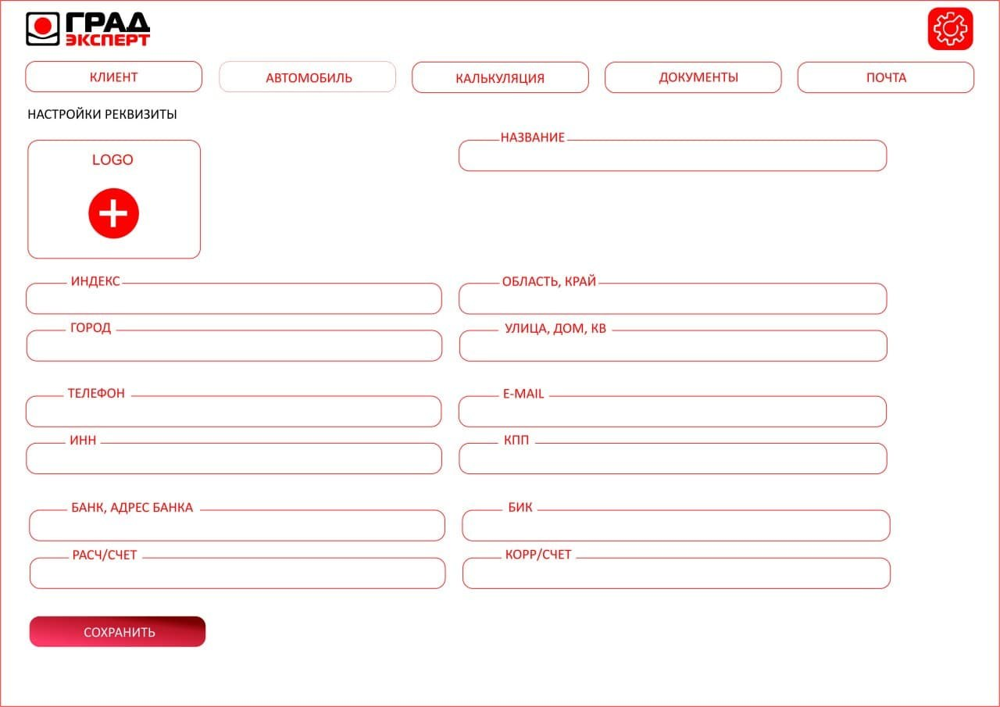

### Программа для расчета стоимости ремонта машины для сервисного центра «Град Эксперт»

  
|  |
| :---: |
| Окно входа |

 
  
|  |
| :---: |
| Список клиентов |
  
  
  
|  |
| :---: |
| Добавление клиента |
  
 
  
|  |
| :---: |
| Список автомобилей |
  
 
  
|  |
| :---: |
| Добавление автомобиля |

 

|  |
| :---: |
| Список калькуляций |
  
 

|  |
| :---: |
| Добавление калькуляции |
  
 

|  |
| :---: |
| Список документов |
  
 

|  |
| :---: |
| Добавление документа |
  
 

|  |
| :---: |
| Общие настройки |
  
 

|  |
| :---: |
| Настройки реквизитов |

